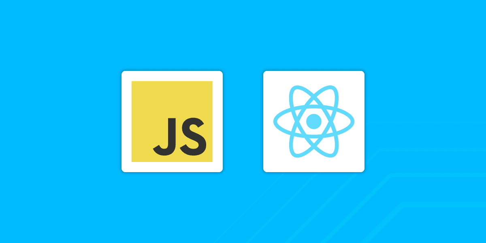

<h1 align="center">React - Estudo</h1>

  
  

  <a href="#-projeto">Projeto</a>&nbsp;&nbsp;&nbsp;|&nbsp;&nbsp;&nbsp;
  <a href="#-tecnologias">Tecnologias</a>&nbsp;&nbsp;&nbsp;|&nbsp;&nbsp;&nbsp;
  <a href="#-etapas">Etapas</a>&nbsp;&nbsp;&nbsp;|&nbsp;&nbsp;&nbsp;
  <a href="#-licença">Licença</a>&nbsp;&nbsp;&nbsp;|&nbsp;&nbsp;&nbsp;
  <a href="#-referências">Referências</a>

  

## 🌱 Projeto

- Repositório para estudos relacionados ao `React`
- Projetos:
    - `Basic Project`
    - `Biscoito da Sorte`
    - `Cronometro`
    - `Contador`
    - `React Nutri`
    - `App Router`
    
## ✨ Tecnologias

- React
- JavaScript

## 🚀 Etapas

- [x] [Estudo básico do Java Script](./base/Readme.md)
- [x] [Estudo básico do React](./base/Readme.md)
- [ ] Projetos
    - [x] [Projeto base]((./basic-project/README.md))
    - [x] [Projeto Biscoito da sorte](./biscoitodasorte/README.md)
    - [x] [Projeto Contador](./contador/README.md)
    - [x] [Projeto Contador utilizando o hook useStates](./contador-usestate/README.md)
    - [x] [Projeto Cronometro](./cronometro/README.md)
    - [x] [Projeto para praticar consumo de uma API](./blog-nutri/README.md)
    - [x] [Projeto para treinar rotas - app-routes](./app-router/README.md)
    - [ ] [Projeto Filmes]

## 📄 Licença
Esse projeto está sob a licença MIT. Veja o arquivo [LICENSE](LICENSE) para mais detalhes.

## 🙇 Referências
- [ Create React App - Getting Started](https://create-react-app.dev/docs/getting-started/)