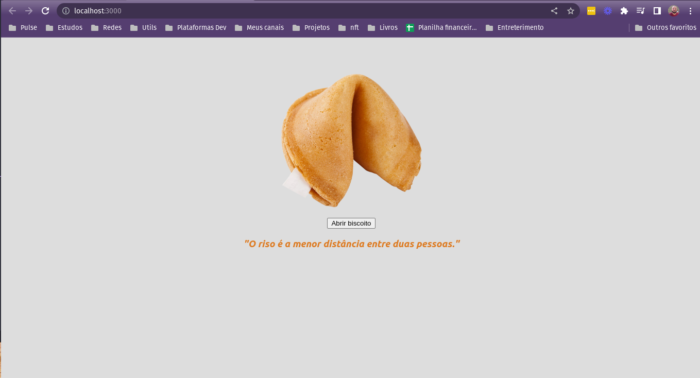

<h1 align="center">Biscoito da Sorte</h1>

<p align="center">
  
</p>

## Project

- Biscoito da Sorte

## Tecnologia

- React
- JavaScript

## Rodando o projeto

- Instalando dependências

```bash
npm install
```

- Startando

```bash
npm start
```