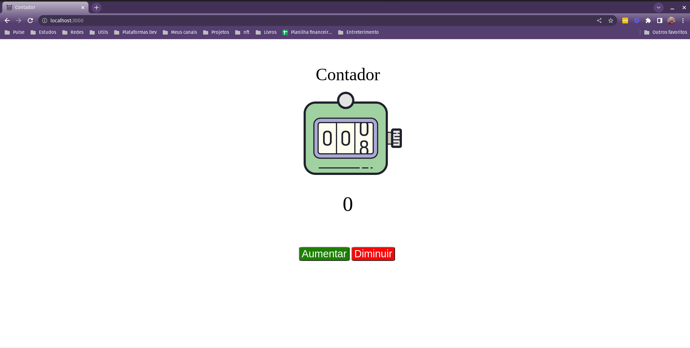

<h1 align="center">Contador</h1>

<p align="center">
  
</p>


## Project

- Contador

## Tecnologia

- React
- JavaScript

## Etapas

- [ ] Criar projeto basico em react
- [ ] Colocar uma imagem
- [ ] Criar botões para aumentar e diminuir
- [ ] Utilizar Hook useState
- [ ] Criar função para diminuir
    - [ ] Não pode diminuir abaixo de zero
- [ ] Criar função para aumentar
- [ ] Criar style

## Rodando o projeto

- Instalando dependências

```bash
npm install
```

- Startando

```bash
npm start
```
 