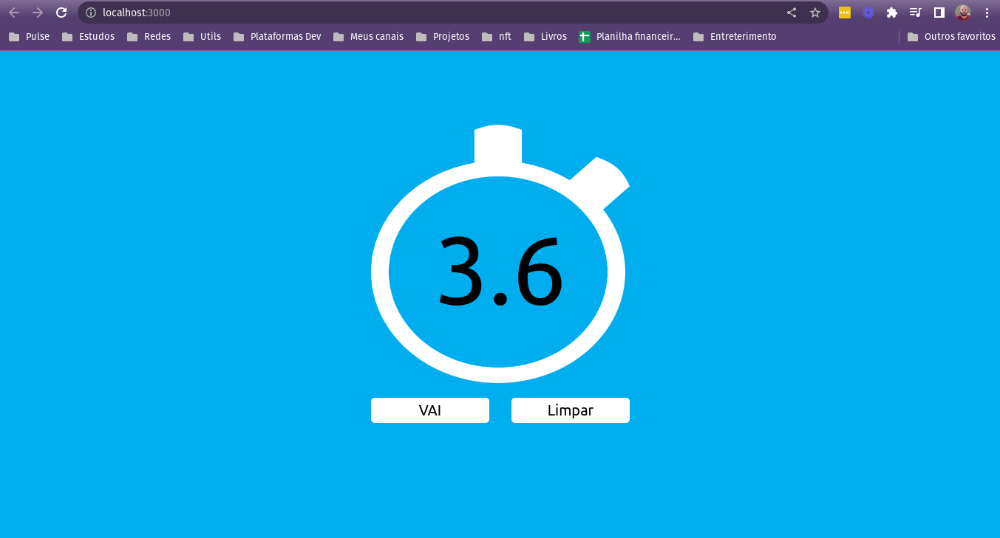

<h1 align="center">Cronometro</h1>

<p align="center">
  
</p>


## Project

- Cronometro

## Tecnologia

- React
- JavaScript

## Rodando o projeto

- Instalando dependências

```bash
npm install
```

- Startando

```bash
npm start
```
 