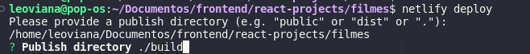
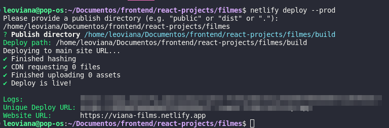

<h1 align="center">Prime Flix</h1>

<p align="center">

</p>

## Project

- Projeto para praticar react - Prime flix, consumir uma api externa de catálogo de filmes.
- URL: https://viana-films.netlify.app/


## Tecnologia

- React
- JavaScript
- Netlify

## Etapas

- [x] Projeto Filmes
    - [x] Criar o projeto
    - [x] Criar o Header
    - [x] Criar a Home
    - [x] Listar filmes
    - [x] Carregar filmes
    - [x] Detalhes do filme
    - [x] Ação trailer
    - [x] Slavar filme na lista
    - [x] Criar página favoritos
    - [x] Manipulando lista de filmes
    - [x] Personalizando alertas do sistema
    
## Rodando o projeto

- Instalando dependências

```bash
npm install
```

- Startando

```bash
npm start
```

## Bibliotecas

- `react-router-dom`
- `react-toastify`
- `axios`
- `netlify-cli`

## Deploy

- Build

```bash
npm run build
```

- Instalando cli do `Netlify`

```bash
npm install -g netlify-cli
```
- Deploy via cli

```bash
netlify deploy
```
- Publish directory: `./build`

<p align="center">
  
</p>


```bash
netlify deploy --prod
```
- Publish directory: `./build`

<p align="center">
  
</p>

## Referência

- [API FILMES](https://www.themoviedb.org/)
- [BIBLIOTECA REACT TOASTTIFY](https://www.npmjs.com/package/react-toastify)
- [NETLIFY](https://app.netlify.com/)