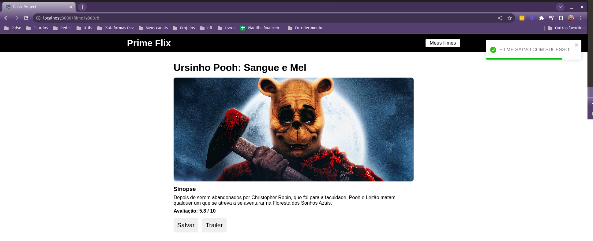

<h1 align="center">Prime Flix</h1>

<p align="center">
  
</p>

## Project

- Projeto para praticar react - Prime flix, consumir uma api externa de catálogo de filmes.

## Tecnologia

- React
- JavaScript

## Etapas

- [ ] Projeto Filmes
    - [x] Criar o projeto
    - [x] Criar o Header
    - [ ] Criar a Home
    - [ ] Listar filmes
    - [ ] Carregar filmes
    - [ ] Detalhes do filme
    - [ ] Ação trailer
    - [ ] Slavar filme na lista
    - [ ] Criar página favoritos
    - [ ] Manipulando lista de filmes
    - [ ] Personalizando alertas do sistema
    
## Rodando o projeto

- Instalando dependências

```bash
npm install
```

- Startando

```bash
npm start
```

## Referência

- [API FILMES](https://www.themoviedb.org/)
- [BIBLIOTECA REACRT TOASTTIFY](https://www.npmjs.com/package/react-toastify)